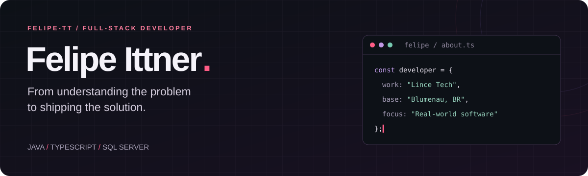

 

**Full-Stack Developer Jr. @ Lince Tech** · Blumenau, Brazil 🇧🇷  
Open to opportunities & technical collaborations

[About](#about) &nbsp; / &nbsp; [Selected work](#selected-work) &nbsp; / &nbsp; [Stack](#stack) &nbsp; / &nbsp; [Journey](#journey)

 

## About

### I started on the other side of the support ticket.

Before building software, I helped people use it: investigating issues, troubleshooting enterprise systems and understanding where workflows broke down. That experience still shapes how I write code.

Today, I develop and maintain **enterprise web systems at Lince Tech**, working with **Java, JavaScript, jQuery and SQL Server**. My day-to-day includes delivering features, fixing bugs and reviewing code.

My personal projects take that same practical approach into **e-commerce, PWAs and automation** — connecting interfaces, business rules, databases and external services.

> **Understand the workflow. Build the solution. Pay attention to what happens after launch.**

 

## Selected work

### 01 / Mikma Lençóis
**An e-commerce business, built end to end.**

A bedding store with its own storefront and admin panel. The project connects the customer experience with the operational work behind each order: payments, shipping, inventory and communication.

| Customer experience | Behind the scenes |
| :--- | :--- |
| Catalog with size, color and fabric variants | Product, order, inventory and coupon management |
| PIX checkout with automatic confirmation | Payment webhooks and server-side price validation |
| Shipping quotes and order tracking | Melhor Envio and Uber Direct integrations |
| Customer account and discount coupons | CSV catalog import and transactional email |

**Engineering details:** Zod validation, role-based access, Redis rate limiting, Sentry monitoring and automated deployment through GitHub Actions.

    

**[Visit the store ↗](https://mikma.com.br)** &nbsp; · &nbsp; [Explore the code](https://github.com/Felipe-tt/mikma-lencois)

---

### 02 / HidroGás
**Condominium meter readings, without the paper trail.**

An installable web app for managing water and gas consumption. Managers record readings and follow consumption through a dashboard; residents access their apartment's history through a personal link or QR code, without creating an account.

- **For managers:** monthly readings, automatic calculations, consumption charts and scheduled email reports.
- **For residents:** direct access to their own consumption history.
- **For access control:** WebAuthn biometric login, apartment tokens, role-based database rules and rate limiting.

**Engineering details:** React interface backed by Firebase Realtime Database and Cloud Functions, with App Check and sanitized monthly backups.

    

**[Explore the code ↗](https://github.com/Felipe-tt/hydrogas)**

---

### 03 / unePets
**A .NET application around pets, people and conversations.**

A web application with pet listings, user profiles and messaging. The codebase separates the domain, services, data infrastructure and MVC presentation into distinct projects.

**Engineering details:** ASP.NET Core MVC on .NET 6, Entity Framework Core with SQL Server, and AutoMapper for object mapping.

   

**[Explore the code ↗](https://github.com/Felipe-tt/unePets)**

 

## Stack

 

| Context | Technologies |
| :--- | :--- |
| **At work** | Java · JavaScript · jQuery · SQL Server · Git · Jira |
| **Web & personal projects** | TypeScript · React · Next.js · Tailwind CSS · Firebase · C# · ASP.NET Core MVC · Entity Framework Core |
| **Automation** | n8n · Botpress · BotConversa · WhatsApp integrations |
| **Development tools** | GitHub Actions · Postman · VS Code · Figma |

### On my learning radar

**Spring Boot · Docker · Kubernetes** — deepening my back-end and infrastructure skills.

 

## Journey

**From IT support to full-stack development — within the same business context.**

| When | Role | Where |
| :--- | :--- | :--- |
| **Nov 2025 → Present** | **Full-Stack Developer Jr.** | **Lince Tech** |
| Mar 2025 → Nov 2025 | Full-Stack Developer Trainee | Lince Tech |
| Sep 2024 → Mar 2025 | Helpdesk II | Lince Tech |
| Sep 2023 → Sep 2024 | Helpdesk I | Lince Tech |
| Apr 2023 → Jun 2023 | Integration Developer | Hiper Automação Digital |

<strong>Education & technical training</strong>

 

| Program | Institution | Period |
| :--- | :--- | :--- |
| **B.Sc. in Information Systems** — in progress | UNIASSELVI | 2023–2027 |
| Java Web Development | Entra21 / SENAI | 2024 |
| Technical Program in Systems Analysis & Development | SENAI/SC | 2022–2023 |
| C# Web Development | Entra21 / ProWay | 2021 |
| Technical Program in Computer Software | Cedup Hermann Hering | 2020–2022 |

 

## Beyond the README

Watch my contributions come to life

 

<picture>
  <source media="(prefers-color-scheme: dark)" srcset="https://raw.githubusercontent.com/Felipe-tt/Felipe-tt/output/github-snake-dark.svg">
  <source media="(prefers-color-scheme: light)" srcset="https://raw.githubusercontent.com/Felipe-tt/Felipe-tt/output/github-snake.svg">
  
</picture>

 

---

### Let's build something people can use.

Have a role, a project or a technical challenge in mind?  
**[Let's connect on LinkedIn](https://www.linkedin.com/in/felipe-ittner-768717247)** · **[Send me an email](mailto:felipe.ttnr@gmail.com)**

Felipe Ittner · Blumenau, SC · Brazil

